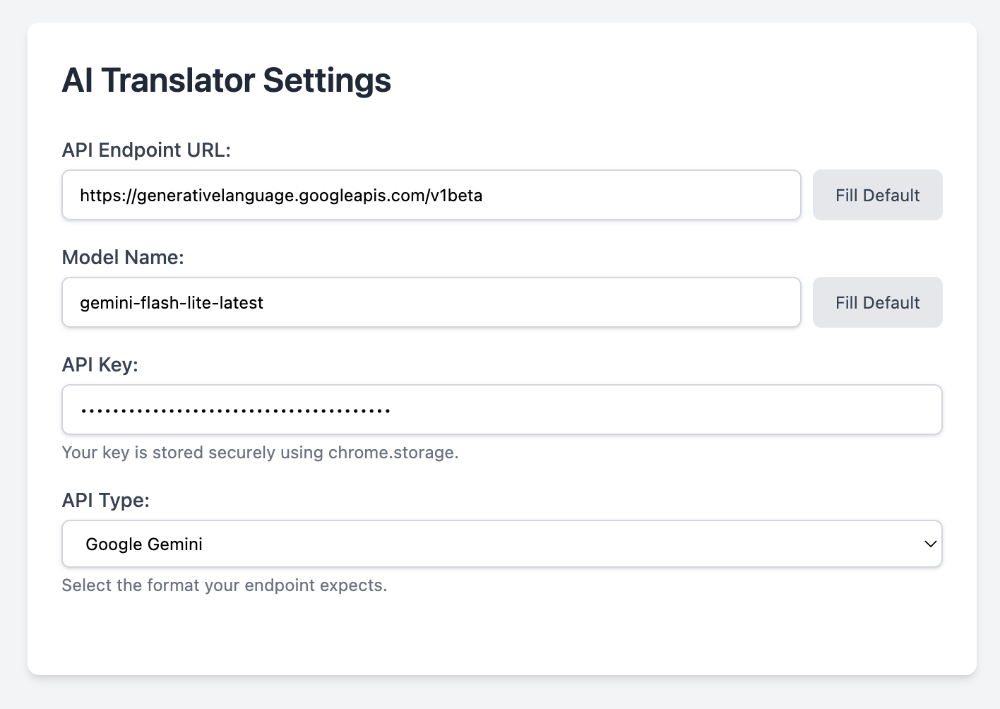

# AI Translator

A Chrome extension that leverages customizable AI models for superior text and page translations.

## Why AI Translator?

- **More Coherent Output**: AI translation delivers natural, context-aware results that surpass traditional Machine Translation (MTL) in coherence and fluency.
- Right-click to translate selected text or entire pages.
- Fully customizable AI models and settings.

## Installation

1. Download or clone this repository.
2. Open Chrome and go to `chrome://extensions/`.
3. Enable **Developer mode** (top-right toggle).
4. Click **Load unpacked** and select the extension folder.

## Usage

1. **Text Translation**: Select text on any webpage, right-click → "Translate Selected Text".
2. **Page Translation**: Right-click anywhere on the page → "Translate Page".
3. **Configure**: Click the extension icon → *Options* to set up API keys, models, languages, etc.

## Options Page Features

- Select AI providers and models (e.g., GPT, Claude).
- Set source and target languages.
- Manage API keys securely.
- Customize translation behavior.

## Screenshots

### AI vs. Traditional Translation
AI-powered translation provides more natural and contextually accurate results compared to traditional services.

| Traditional (DeepL) | AI Translator |
| :--- | :--- |
|  |  |

### Additional Previews

## Roadmap & Current State

### Current Caveats
- **Full-Page Translation**: Functional but experimental. Complex layouts may come out broken after text replacement. Large pages can occasionally hang during the DOM traversal phase.

### Upcoming Features (Roadmap)
- [ ] **Ollama Support**: Investigating local LLM integration via `localhost` API calls (requires handling CORS/Permissions in Manifest V3).
- [ ] **Batch Processing**: Using batch APIs where avaiable (e.g. Google) to save money.

## Tech Stack

- Manifest V3
- Content scripts for page interaction
- Service worker for background API calls
- Tailwind CSS for styling
