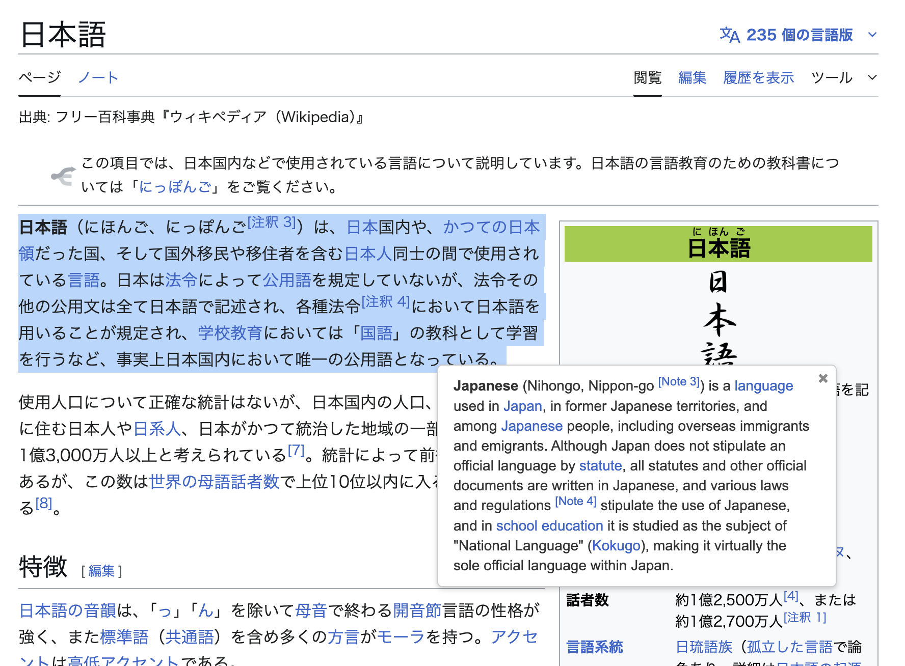
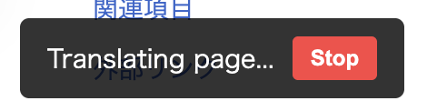

# AI Translator

A Chrome and Firefox extension for translating selected text and webpage content with your choice of AI provider.

[Chrome Web Store](https://chromewebstore.google.com/detail/jabhdcjhdlnppcpbdghnkfkdpfcfleba) · [Firefox Add-ons](https://addons.mozilla.org/en-US/firefox/addon/ai-translator/) · [Documentation](https://adinschmidt.com/AI-translator/)

## Features

- Selection translation through a context menu or inline button, with streaming popups and an option to keep multiple results open.
- Full-page translation in batches, with progress and a Stop button.
- Eleven providers, including local Ollama and OpenAI-compatible endpoints.
- Basic settings for OpenAI, Anthropic, and Google. Advanced settings add custom models, endpoints, model discovery, and optional reasoning overrides.
- Local language detection, configurable target languages, sensitive-data redaction, twelve interface languages, and light, dark, or system themes.

## Screenshots




## Installation

Use the browser-store links above for a signed release. To build from source, install [Bun](https://bun.sh) and run:

```sh
bun install --frozen-lockfile
bun run build
```

- Chrome: open `chrome://extensions/`, enable Developer mode, choose **Load unpacked**, and select `dist/chrome/`.
- Firefox 142 or newer: open `about:debugging#/runtime/this-firefox`, choose **Load Temporary Add-on**, and select `dist/firefox/manifest.json`. Temporary installations disappear when Firefox closes.

The source root is not a loadable extension. You can also extract the appropriate browser ZIP from [Releases](https://github.com/adinschmidt/AI-translator/releases). After rebuilding, reload the extension and refresh affected webpages.

## Usage

Click the toolbar icon to open settings. Choose a provider, enter its API key, and select a target language. Changes save automatically. API usage and billing belong to your provider; Ollama does not require a key.

Select text and click the inline **Translate** button, or right-click **Translate Selected Text**. The inline button appears when local detection recognizes a language different from the target. Right-click **Translate Page** to translate the top-level page. **Stop** leaves completed translations in place; reload the page to restore the original.

The inline button uses the selected target language and Advanced mode's extra instructions. Context-menu and full-page translation currently use stored provider instructions and can fall back to English. See [Usage](https://adinschmidt.com/AI-translator/usage) and [Settings](https://adinschmidt.com/AI-translator/settings) for behavior and limitations.

## Development

```sh
bun run typecheck
bun test src/extension/provider-model.test.ts
bun run check:i18n
bun run build
bun run build:zip
```

The build checks extension locale completeness, replaces `dist/`, bundles TypeScript and ELD, copies DOMPurify from installed dependencies, compiles Tailwind CSS, and copies assets and locale messages. `build:zip` also requires the `zip` command and creates `dist/translator-<version>-chrome.zip` and `dist/translator-<version>-firefox.zip`.

```text
src/extension/   Browser entry points and translation orchestration
src/shared/      Settings, providers, messaging, localization, and redaction
assets/          Options markup, styles, and images
_locales/        Extension interface translations
docs/            VitePress documentation and translated guides
scripts/         Locale completeness check
build.ts         Bun build and packaging
manifest.json    Chrome Manifest V3 configuration
manifest.firefox.json  Firefox Manifest V3 configuration
dist/            Generated browser bundles and ZIPs
```

See the [extension](src/extension/README.md) and [shared](src/shared/README.md) module guides. Provider requests use AI SDK 7. Chrome uses a background service worker; Firefox uses a background script.

### Documentation

Use Node.js 24 to match the documentation workflow:

```sh
cd docs
npm ci
npm run docs:dev
npm run docs:build
npm run docs:preview
```

`docs:dev` starts a development server; stop it before running the remaining commands in the same terminal. `docs:build` writes `docs/.vitepress/dist/`. The site uses the `/AI-translator/` base path. Keep the English guide and the eleven translated guides aligned when changing behavior.

GitHub Actions builds extension artifacts for pull requests and pushes to `master`. Numeric version tags create releases with ZIP artifacts. A separate workflow builds and deploys documentation on pushes to `master` or manual dispatch.

## Privacy

Text and translation instructions go directly to the configured provider. Settings and API keys use browser sync storage and may sync between signed-in devices. The extension has no developer-operated translation backend or analytics service.

Redaction is enabled by default, but pattern matching can miss sensitive information. Console logs can contain credentials, settings, original content, and translations even with Debug mode off. Review logs before sharing them. Local Ollama stays local only if the configured server and model do not forward requests.

Permissions are `contextMenus`, `scripting`, `storage`, and HTTP/HTTPS host access. See the [privacy policy](https://adinschmidt.com/AI-translator/privacy) for details.

## License

[AGPL-3.0](LICENSE)
